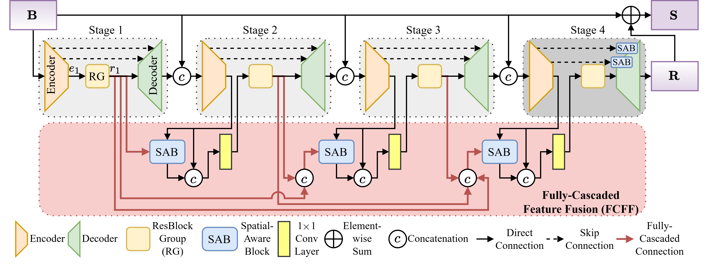

# Fully-Cascaded Spatial-Aware Convolutional Network for Motion Deblurring
by Yinghan Hong, Bishenghui Tao, Qian Wang, Guizhen Mai, Cai Guo.

Pytorch Implementation for the paper "Fully-Cascaded Spatial-Aware Convolutional Network for Motion Deblurring"



## Dependencies
python
```
conda create -n fscnet python=3.8
conda activate fscnet
```
pytorch
```
conda install pytorch==1.8.0 torchvision==0.9.0 torchaudio==0.8.0 cudatoolkit=10.2 -c pytorch
```
warmup_scheduler
```
pip install git+https://github.com/ildoonet/pytorch-gradual-warmup-lr.git
```

## Training
Please download GoPro dataset (https://drive.google.com/file/d/1y4wvPdOG3mojpFCHTqLgriexhbjoWVkK/view) into './dataset', and train the model by running the following command.
```
python train.py
```

## Testing
Please download pretrained model (https://drive.google.com/file/d/1KKv-6ccdsMN32JA715LoXGOCLt7twpqE/view) into './ckpts', and copy test samples into './test_samples'. Then running the following command.
```
python test.py
```

## Citation
If you think this work is useful for your research, please cite the following paper.

```
@article{hong2025fully,
  title={Fully-Cascaded Spatial-Aware Convolutional Network for Motion Deblurring},
  author={Hong, Yinghan and Tao, Bishenghui and Wang, Qian and Mai, Guizhen and Guo, Cai},
  journal={Information},
  volume={16},
  number={12},
  pages={1055},
  year={2025},
  publisher={Multidisciplinary Digital Publishing Institute}
}
```
